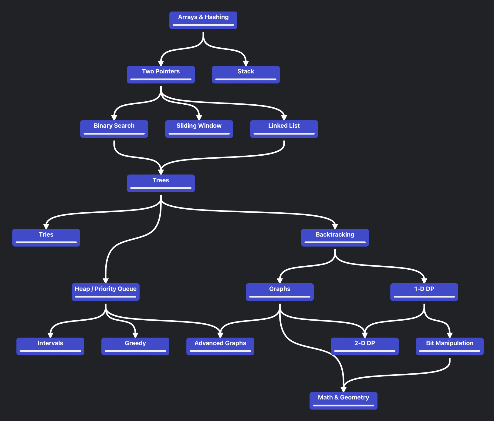

# leetcode-py

My LeetCode Solutions in Python

# NeetCode 150

1. [Arrays & Hashing (9)](#arrays--hashing-9)
2. [Two Pointers (5)](#two-pointers-5)
3. [Sliding Window (6)](#sliding-window-6)
4. [Stack (7)](#stack-7)
5. [Binary Search (7)](#binary-search-7)
6. [Linked List (11)](#linked-list-11)
7. [Trees (15)](#trees-15)
8. [Tries (3)](#tries-3)
9. [Heap / Priority Queue (7)](#heap--priority-queue-7)
10. [Backtracking (9)](#backtracking-9)

## Arrays & Hashing (9)

* [Contains Duplicate (Easy)](0217-contains-duplicate)
* [Valid Anagram (Easy)](0242-valid-anagram)
* [Two Sum (Easy)](0001-two-sum)
* [Group Anagrams (Medium)](0049-group-anagrams)
* [Top K Frequent Elements (Medium)](0347-top-k-frequent-elements)
* [Product of Array Except Self (Medium)](0238-product-of-array-except-self)
* [Valid Sudoku (Medium)](0036-valid-sudoku)
* [Longest Consecutive Sequence (Medium)](0128-longest-consecutive-sequence)

## Two Pointers (5)

* [Valid Palindrome (Easy)](0125-valid-palindrome)
* [Two Sum II Input Array Is Sorted (Medium)](0167-two-sum-ii-input-array-is-sorted)
* [3Sum (Medium)](0015-3sum)
* [Container With Most Water (Medium)](0011-container-with-most-water)
* [Trapping Rain Water (Hard)](0042-trapping-rain-water)

## Sliding Window (6)

* [Best Time to Buy And Sell Stock (Easy)](0121-best-time-to-buy-and-sell-stock)
* [Longest Substring Without Repeating Characters (Medium)](0003-longest-substring-without-repeating-characters)
* [Longest Repeating Character Replacement (Medium)](0424-longest-repeating-character-replacement)
* [Permutation In String (Medium)](0567-permutation-in-string)
* [Minimum Window Substring (Hard)](0076-minimum-window-substring)
* [Sliding Window Maximum (Hard)](0239-sliding-window-maximum)

## Stack (7)

* [Valid Parentheses (Easy)](0020-valid-parentheses)
* [Min Stack (Medium)](0155-min-stack)
* [Evaluate Reverse Polish Notation (Medium)](0150-evaluate-reverse-polish-notation)
* [Generate Parentheses (Medium)](0022-generate-parentheses)
* [Daily Temperatures (Medium)](0739-daily-temperatures)
* [Car Fleet (Medium)](0883-car-fleet)
* Largest Rectangle In Histogram (Hard)

## Binary Search (7)

* [Binary Search (Easy)](0792-binary-search)
* [Search a 2D Matrix (Medium)](0074-search-a-2d-matrix)
* [Koko Eating Bananas (Medium)](0907-koko-eating-bananas)
* [Find Minimum In Rotated Sorted Array (Medium)](0153-find-minimum-in-rotated-sorted-array)
* [Search In Rotated Sorted Array (Medium)](0033-search-in-rotated-sorted-array)
* [Time Based Key Value Store (Medium)](1023-time-based-key-value-store)
* Median of Two Sorted Arrays (Hard)

## Linked List (11)

* [Reverse Linked List (Easy)](0206-reverse-linked-list)
* [Merge Two Sorted Lists (Easy)](0021-merge-two-sorted-lists)
* [Reorder List (Medium)](0143-reorder-list)
* [Remove Nth Node From End of List (Medium)](0019-remove-nth-node-from-end-of-list)
* [Copy List With Random Pointer (Medium)](0138-copy-list-with-random-pointer)
* [Add Two Numbers (Medium)](0002-add-two-numbers)
* [Linked List Cycle (Easy)](0141-linked-list-cycle)
* [Find The Duplicate Number (Medium)](0287-find-the-duplicate-number)
* LRU Cache (Medium)
* Merge K Sorted Lists (Hard)
* Reverse Nodes In K Group (Hard)

## Trees (15)

* [Invert Binary Tree (Easy)](0226-invert-binary-tree)
* [Maximum Depth of Binary Tree (Easy)](0104-maximum-depth-of-binary-tree)
* [Diameter of Binary Tree (Easy)](0543-diameter-of-binary-tree)
* [Balanced Binary Tree (Easy)](0110-balanced-binary-tree)
* [Same Tree (Easy)](0100-same-tree)
* [Subtree of Another Tree (Easy)](0572-subtree-of-another-tree)
* [Lowest Common Ancestor of a Binary Search Tree (Medium)](0235-lowest-common-ancestor-of-a-binary-search-tree)
* [Binary Tree Level Order Traversal (Medium)](0102-binary-tree-level-order-traversal)
* [Binary Tree Right Side View (Medium)](0199-binary-tree-right-side-view)
* [Count Good Nodes In Binary Tree (Medium)](1544-count-good-nodes-in-binary-tree)
* [Validate Binary Search Tree (Medium)](0098-validate-binary-search-tree)
* [Kth Smallest Element In a Bst (Medium)](0230-kth-smallest-element-in-a-bst)
* Construct Binary Tree From Preorder And Inorder Traversal (Medium)
* Binary Tree Maximum Path Sum (Hard)
* Serialize and Deserialize Binary Tree (Hard)

## Tries (3)

* Implement Trie Prefix Tree (Medium)
* Design Add And Search Words Data Structure (Medium)
* Word Search II (Hard)

## Heap / Priority Queue (7)

* [Kth Largest Element In a Stream (Easy)](0789-kth-largest-element-in-a-stream)
* [Last Stone Weight (Easy)](1127-last-stone-weight)
* [K Closest Points to Origin (Medium)](1014-k-closest-points-to-origin)
* [Kth Largest Element In An Array (Medium)](0215-kth-largest-element-in-an-array)
* Task Scheduler (Medium)
* Design Twitter (Medium)
* Find Median From Data Stream (Hard)

## Backtracking (9)

* [Subsets (Medium)](0078-subsets)
* [Combination Sum (Medium)](0039-combination-sum)
* [Permutations (Medium)](0046-permutations)
* Subsets II (Medium)
* Combination Sum II (Medium)
* Word Search (Medium)
* Palindrome Partitioning (Medium)
* Letter Combinations of a Phone Number (Medium)
* N Queens (Hard)
